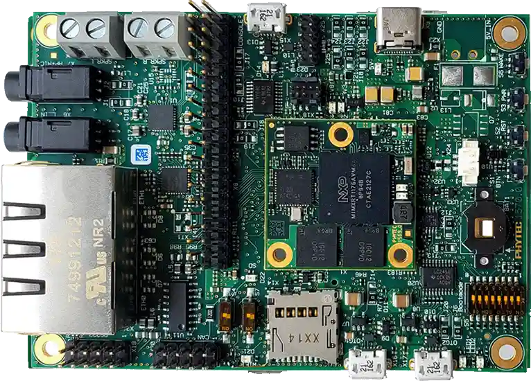

.. _phyboard_atlas:

phyBOARD-Atlas i.MX RT1170
##########################

Overview
********

PHYTEC phyBOARD-Atlas i.MX RT1170 board features phyCORE-i.MX RT1170 System on
Module. The phyCORE-i.MX RT1170 module is based on the NXP dual core i.MX RT1170
which runs on the Cortex-M7 core at 1 GHz and on the Cortex-M4 at 400 MHz.

Hardware
********

- MIMXRT1176DVMAA MCU

  - 1GHz Cortex-M7 & 400Mhz Cortex-M4
  - 2MB SRAM with 512KB of TCM for Cortex-M7 and 256KB of TCM for Cortex-M4

- Memory

  - 512 Mbit SDRAM
  - 128 Mbit QSPI Flash
  - 512 Mbit Octal Flash

- Interfaces

  - MicroSD: 1x microSD Card slot
  - USB: 2x USB 2.0 OTG
  - Ethernet: 2x 10/100/1000BASE-T (RJ45)
  - Expansion: 1x M.2 Connector
  - Display: 1x MIPI-DSI
  - Camera: 1x MIPI CSI
  - Audio: Standard Audio Interface
  - Serial: 1x RS232 (2x5 pin header) + 1x RS485
  - UART: 1x via Expansion Interface
  - CAN: 1x CAN (2x5 pin header)
  - LED: 1x RGB User LED
  - Expansion Interface: 60-pin
  - Security: OPTIGA™ TPM SLB 9670 TPM 2.0
  - Power Input: USB-C 5V/3A

- Debug

   - Micro USB serial debug interface
   - JTAG: via Expansion Interface

For more information about phyCORE-i.MX RT1170 & phyBOARD-Atlas i.MX RT1170
board, see these references:

- `phyCORE-RT1170 Website`_
- `phyBOARD-Atlas i.MX RT1170 Website`_

External Memory
===============

This platform has the following external memories:

+----------------------+------------+-------------------------------------+
| Device               | Controller | Status                              |
+======================+============+=====================================+
| MT48LC16M16A2B4-7EIT | SEMC       | Enabled via device configuration    |
| SDRAM                |            | data (DCD) block, which sets up     |
|                      |            | the SEMC at boot time               |
+----------------------+------------+-------------------------------------+
| MX25U12832FM2I02     | FLEXSPI    | Enabled via flash configuration     |
| QSPI flash           |            | block (FCB), which sets up the      |
|                      |            | FLEXSPI at boot time.               |
+----------------------+------------+-------------------------------------+

Supported Features
==================

The PHYTEC phyBOARD-Atlas i.MX RT1170 configuration supports the following
hardware features:

+-----------+------------+-------------------------------------+
| Interface | Controller | Driver/Component                    |
+===========+============+=====================================+
| NVIC      | on-chip    | nested vector interrupt controller  |
+-----------+------------+-------------------------------------+
| SYSTICK   | on-chip    | systick                             |
+-----------+------------+-------------------------------------+
| GPIO      | on-chip    | gpio                                |
+-----------+------------+-------------------------------------+
| SPI       | on-chip    | spi                                 |
+-----------+------------+-------------------------------------+
| I2C       | on-chip    | i2c                                 |
+-----------+------------+-------------------------------------+
| UART      | on-chip    | serial port-polling;                |
|           |            | serial port-interrupt;              |
|           |            | serial port-async                   |
+-----------+------------+-------------------------------------+
| CAN       | on-chip    | flexcan                             |
+-----------+------------+-------------------------------------+
| ENET      | on-chip    | ethernet - 10/100M                  |
+-----------+------------+-------------------------------------+
| USB       | on-chip    | USB Device                          |
+-----------+------------+-------------------------------------+
| SDHC      | on-chip    | SD host controller                  |
+-----------+------------+-------------------------------------+
| FLEXSPI   | on-chip    | flash programming                   |
+-----------+------------+-------------------------------------+

The default configuration can be found in the defconfig files:
:zephyr_file:`boards/phytec/phyboard_atlas/phyboard_atlas_mimxrt1176_cm7_defconfig`
:zephyr_file:`boards/phytec/phyboard_atlas/phyboard_atlas_mimxrt1176_cm4_defconfig`

Connections and I/Os
====================

The MIMXRT1170 SoC has six pairs of pinmux/gpio controllers.

+-----------------+-----------------+-------------------+
| Name            | Function        | Usage             |
+-----------------+-----------------+-------------------+
| GPIO_AD_24      | LPUART1_TX      | UART Console      |
+-----------------+-----------------+-------------------+
| GPIO_AD_25      | LPUART1_RX      | UART Console      |
+-----------------+-----------------+-------------------+
| GPIO_AD_28      | LPUART5_TX      | UART Console      |
+-----------------+-----------------+-------------------+
| GPIO_AD_29      | LPUART5_RX      | UART Console      |
+-----------------+-----------------+-------------------+
| GPIO_EMC_B1_40  | LPUART6_TX      | UART Console      |
+-----------------+-----------------+-------------------+
| GPIO_EMC_B1_41  | LPUART6_RX      | UART Console      |
+-----------------+-----------------+-------------------+
| GPIO_AD_02      | LPUART8_TX      | RS-232            |
+-----------------+-----------------+-------------------+
| GPIO_AD_03      | LPUART8_RX      | RS-232            |
+-----------------+-----------------+-------------------+
| GPIO_AD_04      | LPUART8_CTS     | RS-232            |
+-----------------+-----------------+-------------------+
| GPIO_AD_05      | LPUART8_RTS     | RS-232            |
+-----------------+-----------------+-------------------+
| GPIO_AD_29      | SPI1_CS0        | spi               |
+-----------------+-----------------+-------------------+
| GPIO_AD_28      | SPI1_CLK        | spi               |
+-----------------+-----------------+-------------------+
| GPIO_AD_30      | SPI1_SDO        | spi               |
+-----------------+-----------------+-------------------+
| GPIO_AD_31      | SPI1_SDI        | spi               |
+-----------------+-----------------+-------------------+
| GPIO_AD_08      | LPI2C1_SCL      | i2c               |
+-----------------+-----------------+-------------------+
| GPIO_AD_09      | LPI2C1_SDA      | i2c               |
+-----------------+-----------------+-------------------+
| GPIO_AD_18      | LPI2C2_SCL      | i2c               |
+-----------------+-----------------+-------------------+
| GPIO_AD_19      | LPI2C2_SDA      | i2c               |
+-----------------+-----------------+-------------------+
| GPIO_SD_B2_05   | FLEXSPI1_DQS    | flash programming |
+-----------------+-----------------+-------------------+
| GPIO_SD_B2_06   | FLEXSPI1_SS0    | flash programming |
+-----------------+-----------------+-------------------+
| GPIO_SD_B2_07   | FLEXSPI1_SCLK   | flash programming |
+-----------------+-----------------+-------------------+
| GPIO_SD_B2_08   | FLEXSPI1_DATA00 | flash programming |
+-----------------+-----------------+-------------------+
| GPIO_SD_B2_09   | FLEXSPI1_DATA01 | flash programming |
+-----------------+-----------------+-------------------+
| GPIO_SD_B2_10   | FLEXSPI1_DATA02 | flash programming |
+-----------------+-----------------+-------------------+
| GPIO_SD_B2_11   | FLEXSPI1_DATA03 | flash programming |
+-----------------+-----------------+-------------------+
| GPIO_DISP_B2_02 | ENET_TX_DATA00  | Ethernet          |
+-----------------+-----------------+-------------------+
| GPIO_DISP_B2_03 | ENET_TX_DATA01  | Ethernet          |
+-----------------+-----------------+-------------------+
| GPIO_DISP_B2_04 | ENET_TX_EN      | Ethernet          |
+-----------------+-----------------+-------------------+
| GPIO_DISP_B2_05 | ENET_REF_CLK    | Ethernet          |
+-----------------+-----------------+-------------------+
| GPIO_DISP_B2_06 | ENET_RX_DATA00  | Ethernet          |
+-----------------+-----------------+-------------------+
| GPIO_DISP_B2_07 | ENET_RX_DATA01  | Ethernet          |
+-----------------+-----------------+-------------------+
| GPIO_DISP_B2_08 | ENET_RX_EN      | Ethernet          |
+-----------------+-----------------+-------------------+
| GPIO_DISP_B2_09 | ENET_RX_ER      | Ethernet          |
+-----------------+-----------------+-------------------+
| GPIO_AD_32      | ENET_MDC        | Ethernet          |
+-----------------+-----------------+-------------------+
| GPIO_AD_33      | ENET_MDIO       | Ethernet          |
+-----------------+-----------------+-------------------+
| GPIO_LPSR_00    | CAN3_TX         | flexcan           |
+-----------------+-----------------+-------------------+
| GPIO_LPSR_01    | CAN3_RX         | flexcan           |
+-----------------+-----------------+-------------------+
| GPIO_SD_B1_00   | USDHC1_CMD      | SDHC              |
+-----------------+-----------------+-------------------+
| GPIO_SD_B1_01   | USDHC1_CLK      | SDHC              |
+-----------------+-----------------+-------------------+
| GPIO_SD_B1_02   | USDHC1_DATA0    | SDHC              |
+-----------------+-----------------+-------------------+
| GPIO_SD_B1_03   | USDHC1_DATA1    | SDHC              |
+-----------------+-----------------+-------------------+
| GPIO_SD_B1_04   | USDHC1_DATA2    | SDHC              |
+-----------------+-----------------+-------------------+
| GPIO_SD_B1_05   | USDHC1_DATA3    | SDHC              |
+-----------------+-----------------+-------------------+

Dual Core samples
*****************

+-----------+------------------+------------------+
| Core      | Boot Address     | Comment          |
+===========+==================+==================+
| Cortex M7 | 0x30000000[630K] | primary core     |
+-----------+------------------+------------------+
| Cortex M4 | 0x20020000[96k]  | boots from OCRAM |
+-----------+------------------+------------------+

+----------+------------------+-----------------------+
| Memory   | Address[Size]    | Comment               |
+==========+==================+=======================+
| flexspi1 | 0x30000000[16M]  | Cortex M7 flash       |
+----------+------------------+-----------------------+
| sdram0   | 0x80030000[64M]  | Cortex M7 ram         |
+----------+------------------+-----------------------+
| ocram    | 0x20020000[512K] | Cortex M4 "flash"     |
+----------+------------------+-----------------------+
| sram1    | 0x20000000[128K] | Cortex M4 ram         |
+----------+------------------+-----------------------+
| ocram2   | 0x200C0000[512K] | Mailbox/shared memory |
+----------+------------------+-----------------------+

Only the first 16K of ocram2 has the correct MPU region attributes set to be
used as shared memory

System Clock
============

The MIMXRT1170 SoC is configured to use SysTick as the system clock source,
running at 996MHz. When targeting the M4 core, SysTick will also be used,
running at 400MHz

When power management is enabled, the 32 KHz low frequency
oscillator on the board will be used as a source for the GPT timer to
generate a system clock. This clock enables lower power states, at the
cost of reduced resolution

Serial Port
===========

The MIMXRT1170 SoC has 12 UARTs. One is configured for the console and the
remaining are not used.

Programming and Debugging
*************************

Build and flash applications as usual (see :ref:`build_an_application` and
:ref:`application_run` for more details).

Configuring a Debug Probe
=========================

A debug probe is used for both flashing and debugging the board. The on-board
debugger works with the JLink runner by default.

Using J-Link
------------

JLink is the default runner for this board.  Install the
:ref:`jlink-debug-host-tools` and make sure they are in your search path.

Configuring a Console
=====================

We will use the on-board debugger microcontroller as a usb-to-serial adapter for
the serial console.

Use the following settings with your serial terminal of choice (minicom, putty,
etc.):

- Speed: 115200
- Data: 8 bits
- Parity: None
- Stop bits: 1

Flashing
========

Here is an example for the :zephyr:code-sample:`hello_world` application.

.. zephyr-app-commands::
   :zephyr-app: samples/hello_world
   :board: phyboard_atlas/mimxrt1176/cm7
   :goals: flash

Power off the board. Then power on the board and
open a serial terminal, reset the board and you should
see the following message in the terminal:

.. code-block:: console

   ***** Booting Zephyr OS v4.0.0-xxxx-xxxxxxxxxxxxx *****
   Hello World! phyboard_atlas/mimxrt1176/cm7

Debugging
=========

Here is an example for the :zephyr:code-sample:`hello_world` application.

.. zephyr-app-commands::
   :zephyr-app: samples/hello_world
   :board: phyboard_atlas/mimxrt1176/cm7
   :goals: debug

Open a serial terminal, step through the application in your debugger, and you
should see the following message in the terminal:

.. code-block:: console

   ***** Booting Zephyr OS v4.4.0-xxxx-xxxxxxxxxxxxx *****
   Hello World! phyboard_atlas/mimxrt1176/cm7

References
**********

.. target-notes::

.. _phyCORE-i.MX RT1170 Website:
   https://www.phytec.com/product/phycore-rt1170

.. _phyBOARD-Atlas i.MX RT1170 Website:
   https://www.phytec.com/product/phyboard-rt1170-development-kit/

.. _AN13264:
   https://www.nxp.com/docs/en/application-note/AN13264.pdf
